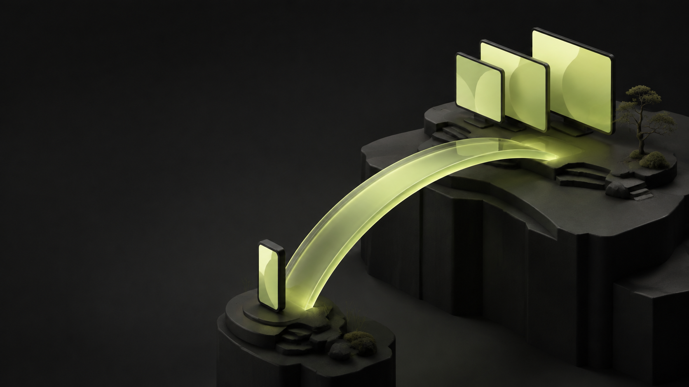
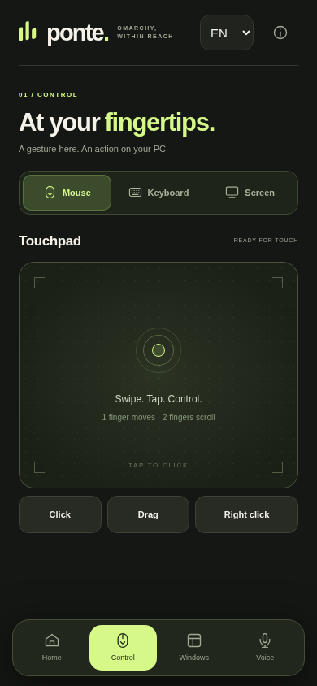
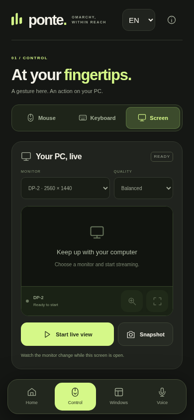
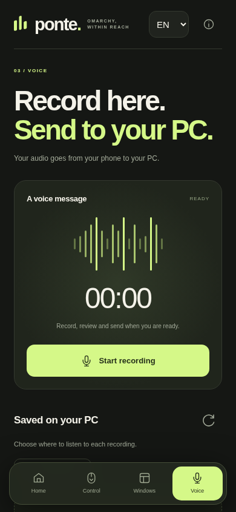

<p align="center"></p>

<h1 align="center">ponte.</h1>
<p align="center"><strong>Your Omarchy desktop, within reach.</strong><br>Touch controls and live monitor views on your Android phone, over Tailscale.</p>
<p align="center"><a href="README.pt-BR.md">Português</a> · <a href="#try-it">Setup</a> · <a href="docs/evidence.md">Real device evidence</a> · <a href="docs/presentation.pdf">Presentation</a> · <a href="https://lucasol1337.github.io/ponte/">Project page</a> · <a href="CONTRIBUTING.md">Contribute</a></p>

Ponte started with a simple wish: open an app on my phone and use my Omarchy PC from wherever I am. Move the pointer, type a sentence, switch windows, and see what is happening on a monitor without rebuilding a desktop interface on a small screen.

This is an independent **experimental alpha**. Live video and persistent pairing have been verified on a Redmi Note 13 Pro+ running Android 14. The public setup builds an APK for your own PC. English is the default. Choose Portuguese in the language selector and Ponte remembers your preference. See the [tested scope and remaining work](docs/evidence.md) before installing.

## The interface

<p align="center">  </p>

These English previews show the running app connected to a read-only review instance on the PC. The [original Redmi captures](docs/evidence.md#physical-android-device) document the physical-device test in Portuguese. The cover is AI-generated concept art. The voice screenshot shows the idle interface, not proof of a successful recording.

## What it does

| Control | Behavior |
| --- | --- |
| Touchpad | Pointer movement, tap to click, two-finger scrolling, drag and right click |
| Keyboard | Send text and common shortcuts to the current PC window |
| Windows | Browse windows and workspaces, then focus the one you want |
| Monitor view | Opens first. Watch live, rotate, pinch a real-resolution crop, tap the image in Direct touch, or freeze a full-resolution frame to read |
| Terminals | Read and type in dedicated text sessions, with explicit Enter and desktop attachment |
| Media | Volume, mute, playback and track controls |
| Power | Per-monitor on/off toggles, Smart sleep and Wake up superbuttons, double-confirmed power off; WoL metadata exposed for remote wake |
| Voice | Record, review, send to the PC and play back. Android recording verification is still in progress |
| Pairing | Pair once. The app remembers the connection across restarts |

Live view uses authenticated MJPEG with profiles up to 10 frames per second. It does not stream system audio. This is intended for desktop control and checking progress, not gaming or high-frame-rate remote video.

View, Direct touch, Touchpad and Keyboard share the monitor, so you can watch the PC while controlling it. Zooming the live image captures only the visible region at full resolution. Direct touch clicks that image; the separate touchpad remains available. The image sits above the controls in portrait and beside them in landscape. The combined layout is browser-tested; its physical Android keyboard check remains pending.

See the [screen and terminal guide](docs/screen-and-terminals.md) for the new navigation and session behavior. These changes target the next alpha. Its personalized Android update has been installed and checked on the Redmi for live Screen entry, landscape fullscreen and terminal execution. Soft-keyboard completion and microphone recording remain pending.

## Try it

You need an active Omarchy/Hyprland graphical session, Node.js 22+, Python 3.12+, OpenSSL 3, and Tailscale connected on both devices. Desktop capabilities use `hyprctl`, `ydotool`/`ydotoold`, `wtype`, `grim`, `wpctl`, `ffmpeg` and `ffplay`. Text sessions also require `tmux`. The input service needs your user's existing access to `/dev/uinput`.

```sh
git clone https://github.com/LucasOl1337/ponte.git
cd ponte
./ponte setup
./ponte install
./android/build.sh
```

Setup creates private local configuration and a certificate for your Tailscale address. Installation explicitly enables a user service. The build downloads verified, pinned Android tools into `.work/` and writes `.work/Ponte.apk`. Transfer that file privately to your phone, install it, open Ponte, and enter the pairing key from `./ponte pair`. Add the app icon to your first home screen. Future launches remember the pairing.

The first alpha still requires this one-time build and pairing step. Improving that first connection is a priority. Your customized APK contains your server address and public certificate, so build it locally rather than redistributing somebody else's APK.

For a fresh local development configuration, use the following instead of the remote setup above. This does not change an existing TLS configuration:

```sh
./ponte setup --local-only
npm start
```

See the [CLI and configuration guide](docs/setup.md) and [Android build guide](android/README.md) for paths, lifecycle, updates and troubleshooting.

## Connection and privacy

Ponte runs a Node server on your PC. The Android app serves the interface through a private loopback proxy and connects to the PC's Tailscale address over TLS. The APK pins the exact server certificate before sending authorization. HTTP stays on loopback.

Every control API requires a pairing token. The server uses an explicit action list and bounded subprocess arguments. It stores voice files on your PC. Ponte has no analytics SDK and does not send recordings to an AI provider.

A paired phone can operate your live desktop and view its screens. Treat it like physical access. Tailscale membership and access rules remain your responsibility. Read [the security model](SECURITY.md), including certificate renewal and token revocation, before exposing the service to another device.

## Development

The backend and web UI have no production npm dependencies.

```sh
npm test
./android/test.sh
python3 android/tests/build_fixture_test.py
```

Tests use temporary data and synthetic servers. They do not need a real phone or inject input into your desktop. The full Android fixture build downloads the pinned toolchain on its first run.

| Path | Responsibility |
| --- | --- |
| `backend/` and `server.mjs` | Authentication, desktop actions, monitor capture and audio storage |
| `public/` | Mobile interface, live frame parser and recording controls |
| `android/` | Android shell, certificate pinning and loopback transport |
| `ponte` | Local configuration and user service management |
| `docs/` | Setup, measured evidence, project page and presentation |

## What comes next

The first priorities are a simpler pairing flow, completion of recording verification on physical Android devices, additional translations, and measurements over cellular or geographically remote Tailscale connections. Contributions that include a reproducible test are welcome. The [PC-controls-phone spec](docs/pc-controls-phone.md) evaluates the reverse direction: operating the paired phone from the PC over the same Tailscale network. Validate new builds on the device with the [manual test checklist](docs/manual-test-checklist.md).

This project is independent of Omarchy. Any upstream integration is a proposal until Omarchy's maintainers accept it. [Omarchy](https://github.com/omacom/omarchy) is created by [DHH](https://dhh.dk/).

## License

Ponte source code is [MIT licensed](LICENSE). Third-party build tools retain their own licenses and are downloaded from their publishers. The interview frame in the evidence screenshots remains the property of its respective rights holders. See [asset credits](docs/assets.md).
