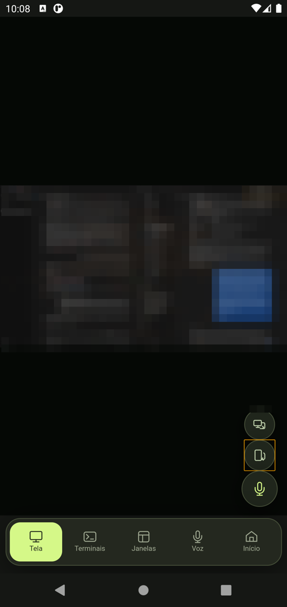
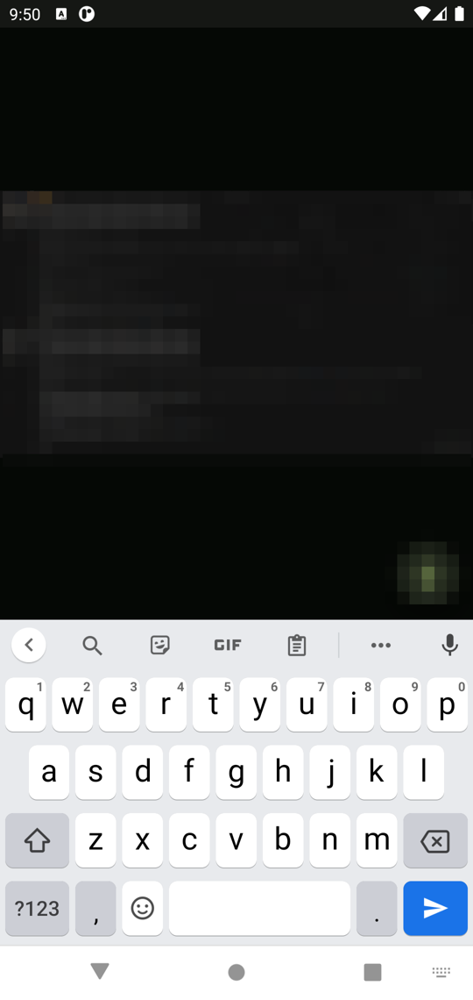
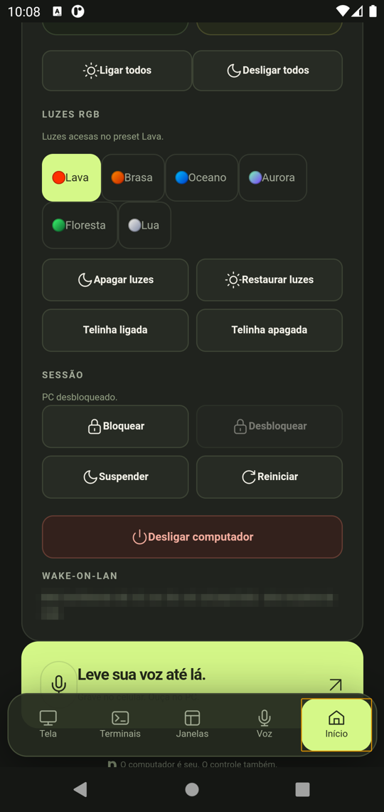
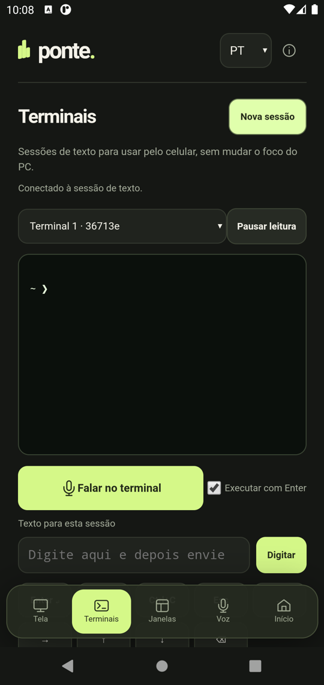
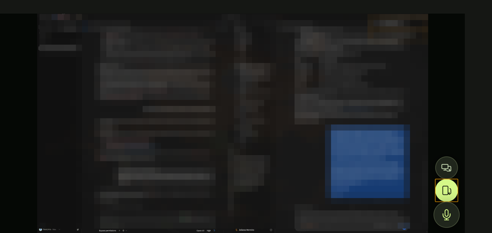

<p align="center"></p>

<h1 align="center">ponte.</h1>
<p align="center"><strong>Your Omarchy desktop, within reach.</strong><br>Touch controls and live monitor views on your Android phone, over Tailscale.</p>
<p align="center"><a href="README.pt-BR.md">Português</a> · <a href="#try-it">Setup</a> · <a href="docs/evidence.md">Real device evidence</a> · <a href="docs/presentation.pdf">Presentation</a> · <a href="https://lucasol1337.github.io/ponte/">Project page</a> · <a href="CONTRIBUTING.md">Contribute</a></p>

Ponte started with a simple wish: open an app on my phone and use my Omarchy PC from wherever I am. Move the pointer, type a sentence, switch windows, and see what is happening on a monitor without rebuilding a desktop interface on a small screen.

This is an independent **experimental alpha**. Live video and persistent pairing have been verified on a Redmi Note 13 Pro+ running Android 14. The public setup builds an APK for your own PC. English is the default. Choose Portuguese in the language selector and Ponte remembers your preference. See the [tested scope and remaining work](docs/evidence.md) before installing.

## The interface

<p align="center">   </p>

<p align="center"></p>

These are Android 11 emulator captures of the current interface in Portuguese; the streamed desktop is pixelated because it is a real work session. The [original Redmi captures](docs/evidence.md#physical-android-device) document the first physical-device test. The cover is AI-generated concept art. See the [changelog](CHANGELOG.md) for what each alpha added and how it was verified.

## What it does

| Control | Behavior |
| --- | --- |
| Screen | Opens first. The monitor fills the phone: tap clicks, long-press right-clicks or drags, pinch zooms, one finger pans while zoomed, two fingers scroll the PC. Tap a text field on the PC and the phone keyboard rises; what you type goes to the PC live |
| Screen buttons | Switch to the next monitor, force landscape edge to edge (and release it), dictate into the focused field |
| Terminals | Read and type in dedicated text sessions, or **speak**: the PC transcribes and types into the selected session, then presses Enter |
| Windows | Browse windows and workspaces, then focus the one you want |
| Media | Volume, mute, playback and track controls |
| Power | Per-monitor on/off, all monitors on/off, Smart sleep and Wake up, suspend, restart, double-confirmed power off; Wake-on-LAN status |
| Lights | Six RGB presets, lights off/restore, water-cooler screen on/off (through the Magma controller, optional) |
| Session | Lock, and unlock by typing your password through the app while the Omarchy lock is up |
| Voice | Record, review, send to the PC and play back |
| Pairing | Pair once. The app remembers the connection across restarts |

Live view is authenticated MJPEG. The default *Sharp* profile streams native pixels at up to 15 fps; *Balanced* and *Light* trade resolution for bandwidth. Zoom is a continuous transform on the phone, like Chrome Remote Desktop: the frame never gets re-cropped mid-pinch, and the *Sharp* profile stays crisp up to 1:1. It does not stream system audio. This is intended for desktop control and checking progress, not gaming.

The keyboard raise relies on fcitx5 running on the PC, which is how Ponte learns that a text field has focus. Dictation uses the Sussurro socket when it is running, or any OpenAI-compatible transcription endpoint (`PONTE_STT_URL`, OmniVoice Studio by default). Audio is transcribed and discarded. See the [screen and terminal guide](docs/screen-and-terminals.md).

From any device on your tailnet, `ssh user@<tailscale-ip> ./ponte pc <lock|unlock|sleep|wake|suspend|reboot|off|monitors on|off [NAME]|lights NAME>` runs the same validated actions without the app; `unlock` reads the password from stdin.

To see and control the phone from this PC over Tailscale, use `./ponte phone status`, then `./ponte phone connect` (default `100.111.221.82:5555`) and `./ponte phone view`. Step-by-step: [PC controls phone](docs/pc-controls-phone.md).

To watch the Omarchy notebook over the same tailnet, use `./ponte notebook status` and `./ponte notebook view` (Sunshine + Moonlight, host `100.91.100.95`).

## Try it

You need an active Omarchy/Hyprland graphical session, Node.js 22+, Python 3.12+, OpenSSL 3, and Tailscale connected on both devices. Desktop capabilities use `hyprctl`, `ydotool`/`ydotoold`, `wtype`, `grim`, `wpctl`, `ffmpeg` and `ffplay`. Text sessions also require `tmux`. The input service needs your user's existing access to `/dev/uinput`.

```sh
git clone https://github.com/LucasOl1337/ponte.git
cd ponte
./ponte setup
./ponte install
./android/build.sh
```

Setup creates private local configuration and a certificate for your Tailscale address. Installation explicitly enables a user service. The build downloads verified, pinned Android tools into `.work/` and writes `.work/Ponte.apk`. Transfer that file privately to your phone, install it, open Ponte, and enter the pairing key from `./ponte pair`. Add the app icon to your first home screen. Future launches remember the pairing.

The first alpha still requires this one-time build and pairing step. Improving that first connection is a priority. Your customized APK contains your server address and public certificate, so build it locally rather than redistributing somebody else's APK.

For a fresh local development configuration, use the following instead of the remote setup above. This does not change an existing TLS configuration:

```sh
./ponte setup --local-only
npm start
```

See the [CLI and configuration guide](docs/setup.md) and [Android build guide](android/README.md) for paths, lifecycle, updates and troubleshooting.

## Connection and privacy

Ponte runs a Node server on your PC. The Android app serves the interface through a private loopback proxy and connects to the PC's Tailscale address over TLS. The APK pins the exact server certificate before sending authorization. HTTP stays on loopback.

Every control API requires a pairing token. The server uses an explicit action list and bounded subprocess arguments. It stores voice files on your PC. Ponte has no analytics SDK and does not send recordings to an AI provider.

A paired phone can operate your live desktop and view its screens. Treat it like physical access. Tailscale membership and access rules remain your responsibility. Read [the security model](SECURITY.md), including certificate renewal and token revocation, before exposing the service to another device.

## Development

The backend and web UI have no production npm dependencies.

```sh
npm test
./android/test.sh
python3 android/tests/build_fixture_test.py
```

Tests use temporary data and synthetic servers. They do not need a real phone or inject input into your desktop. The full Android fixture build downloads the pinned toolchain on its first run.

| Path | Responsibility |
| --- | --- |
| `backend/` and `server.mjs` | Authentication, desktop actions, monitor capture and audio storage |
| `public/` | Mobile interface, live frame parser and recording controls |
| `android/` | Android shell, certificate pinning and loopback transport |
| `ponte` | Local configuration and user service management |
| `docs/` | Setup, measured evidence, project page and presentation |

## What comes next

The first priorities are a simpler pairing flow, a live check of unlock on a locked session, a keyboard-raise signal that does not depend on fcitx5, additional translations, and measurements over cellular or geographically remote Tailscale connections. Contributions that include a reproducible test are welcome. The [PC-controls-phone spec](docs/pc-controls-phone.md) evaluates the reverse direction: operating the paired phone from the PC over the same Tailscale network. Validate new builds on the device with the [manual test checklist](docs/manual-test-checklist.md).

This project is independent of Omarchy. Any upstream integration is a proposal until Omarchy's maintainers accept it. [Omarchy](https://github.com/omacom/omarchy) is created by [DHH](https://dhh.dk/).

## License

Ponte source code is [MIT licensed](LICENSE). Third-party build tools retain their own licenses and are downloaded from their publishers. The interview frame in the evidence screenshots remains the property of its respective rights holders. See [asset credits](docs/assets.md).
