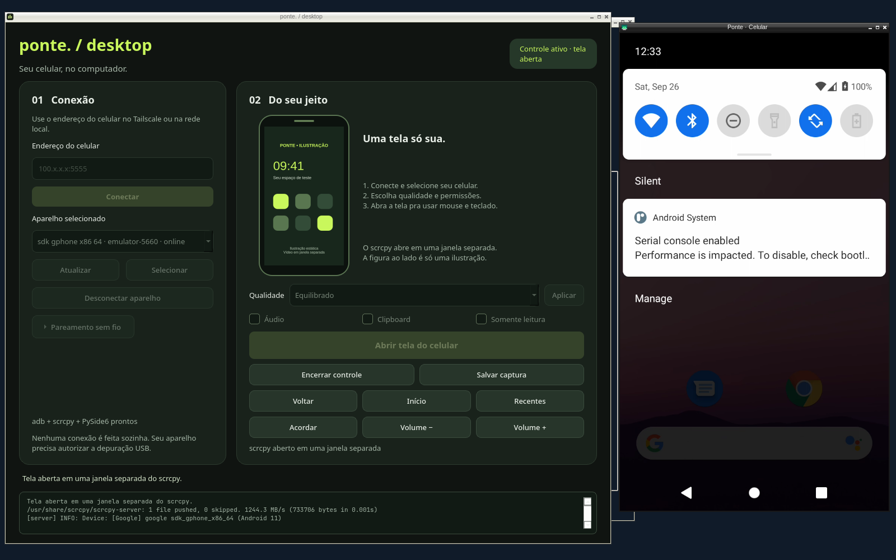
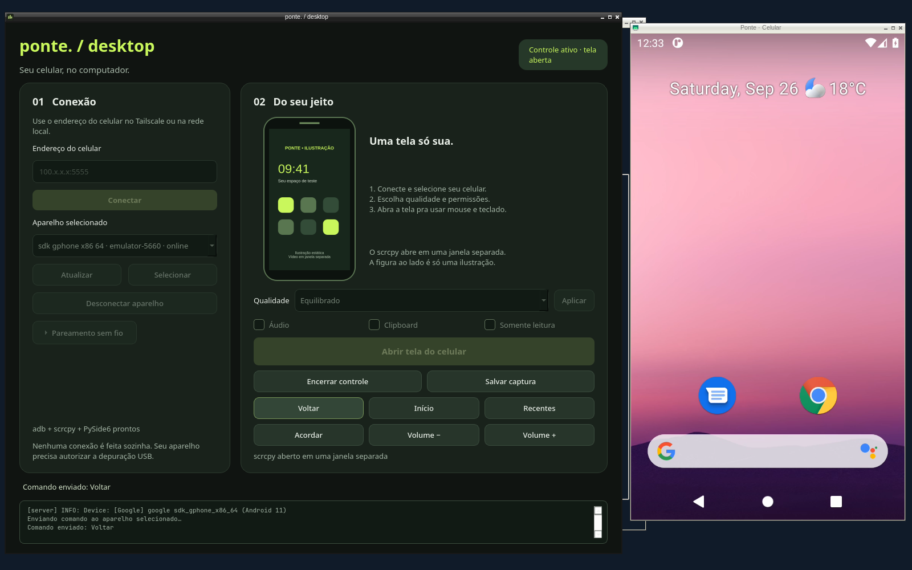
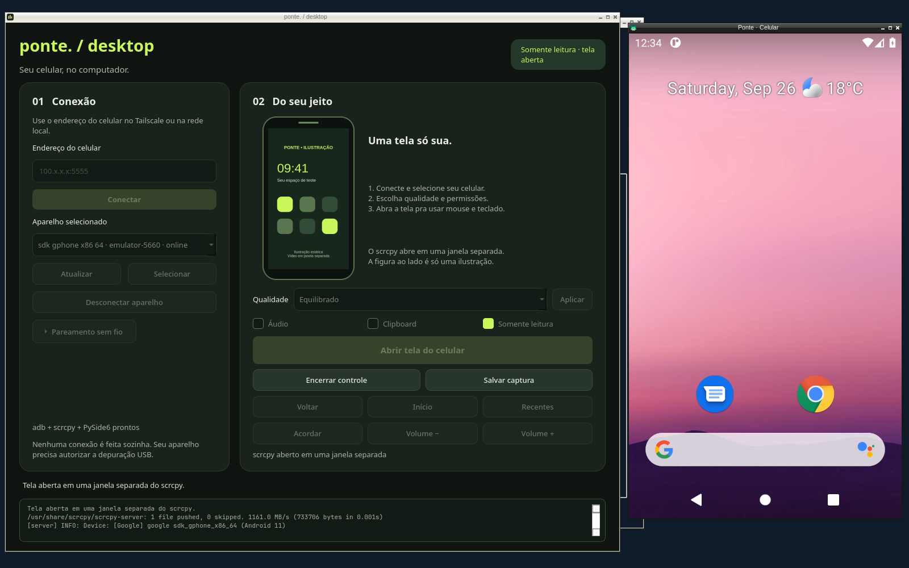

# Aceitação do Ponte Desktop

Data: 26/09/2026, entre 03:20 e 03:35 UTC. Código validado: `ebe34fc`.

## Antes e depois

Antes, o Ponte tinha o APK que controla o PC e comandos `phone` para ADB/scrcpy,
mas não tinha aplicativo de computador para gerenciar o controle do celular.
Agora `./ponte desktop` abre um app nativo Linux e **Ponte Desktop** está disponível
como atalho instalável no menu. A CLI JSON permite os mesmos fluxos de conexão,
seleção, vídeo, entrada e captura sem depender de Qt.

A melhoria foi observada no fluxo de uso, não inferida só pelos testes:

1. O app listou um Android isolado e exigiu seleção explícita no primeiro uso.
2. **Abrir tela do celular** iniciou scrcpy real, com imagem Android ao vivo.
3. Um arraste do mouse na janela de vídeo abriu o painel de notificações.
4. **Voltar**, na janela nativa do Ponte, fechou o painel e restaurou a tela inicial.
5. **Encerrar controle** terminou o processo scrcpy daquela sessão.
6. Com **Somente leitura** marcado, os botões de entrada ficaram bloqueados e o
   mesmo arraste não abriu notificações. O processo tinha `--no-control`.
7. **Salvar captura** abriu o diálogo nativo e criou um PNG real do Android,
   720×1280, 316.500 bytes, permissão `0600`. O arquivo foi aberto e inspecionado.
8. Fechar o app com viewer ativo encerrou ambos os processos, sem deixar viewer
   órfão. Esse fluxo foi repetido após as correções visuais finais.
9. O launcher instalado foi aberto por `gio launch` na bancada e iniciou a GUI
   real. A segunda instalação retornou `changed:false`. Nenhum vídeo ou conexão
   foi iniciado automaticamente na abertura.

## Evidências visuais

As imagens são capturas integrais da bancada isolada. Não são renders ou mockups.
O telefone desenhado dentro do painel esquerdo é uma ilustração estática declarada.
A janela à direita é scrcpy conectado ao Android em execução.

### Gesto chegou ao Android



### Voltar pelo app restaurou a tela inicial



### Somente leitura bloqueou o mesmo gesto



A [captura PNG feita pelo botão do app](assets/desktop-capture.png) contém somente
a tela do Android, sem o desktop da bancada. As três imagens anteriores mostram
a versão final, depois da correção de rótulos. O PNG do celular foi salvo antes
dessa correção de texto, pelo mesmo fluxo de captura.

## Ambiente e isolamento

- Linux, Python 3.14.7, PySide6 6.11.2, ADB 37.0.0 e scrcpy 4.1.
- Bancada exclusiva `ponte-desktop-app`, XCB, 1600×1000, display `:84`, workspace 9.
- Android 11/API 30 Google APIs x86_64, emulador descartável
  `ponte-desktop-acceptance`, serial `emulator-5660`, tela 720×1280.
- AVD, HOME, configuração, estado e chaves de teste isolados. Servidor ADB
  exclusivo em `127.0.0.1:5042`, sem usar o servidor/chaves pessoais.
- Emulador e vídeo executados somente depois de obter vaga na fila pesada.
- Nenhum celular físico, compositor humano, clipboard pessoal ou APK instalado
  no aparelho do usuário foi usado nos testes.
- Ao concluir, GUI e viewers próprios encerrados, emulador desligado, servidor
  ADB privado parado, portas 5042/5660/5661 sem listener. Vaga liberada e bancada
  encerrada. Ficaram somente o launcher entregue, evidências e arquivos de teste.

O Android é real dentro de um emulador, com ADB, codec e scrcpy reais. Isso não
certifica latência de rede, comportamento de fabricante ou autorização USB de
um aparelho físico.

## Matriz de requisitos e verificações

| Requisito | Verificação executada | Resultado |
| --- | --- | --- |
| App Linux funcional | Abrir pelo CLI e pelo launcher instalado, selecionar Android, abrir vídeo e enviar entrada | Fluxo real concluído |
| Não quebrar Android → PC | `npm test`, checks nativos Android, fixtures Python e build APK sintético | Verdes, APK existente preservado |
| Não conectar ou escolher outro aparelho sozinho | Startup/candidato/combo por Qt, autorização e múltiplos seriais por fixtures, primeiro uso real sem seleção | Nenhum fallback ou controle implícito |
| Vídeo e controle gerenciados | scrcpy real, gesto de mouse e botão Voltar, QProcess e CLI com subprocessos de teste | Efeito visível no Android e ciclo de vida observado |
| Parar/fechar só nosso viewer | Encerrar controle e fechar app ao vivo, PID conferido, testes de processo não cooperativo e corrida de saída | Filhos encerrados, processo alheio preservado nos testes |
| GUI responsiva e erros recuperáveis | Workers Qt com barreiras, falha de status, falha no start e fechamento durante worker | 35 testes GUI verdes em offscreen e XCB |
| Layout sem sobreposição | Inspeção visual e regressão de geometria em tamanhos menores e pareamento expandido | Problema encontrado, corrigido e revalidado |
| Estado visual verdadeiro | Badge ativo/readonly/demo e legenda da ilustração, teste e nova captura com Android | Textos corrigidos e observados |
| Somente leitura | Gesto real não alterou Android, botões bloqueados, argv `--no-control`, testes de ações recusadas | Bloqueio observado e automatizado |
| Áudio/clipboard opt-in e qualidade | Flags reais sem áudio/autosync, testes de todos os perfis e limites | Defaults confirmados, perfis validados por argv |
| Screenshot privado e exclusivo | Diálogo real salvou PNG válido `0600`, testes de colisão, symlink, timeout e cleanup por inode | Imagem observada, sem sobrescrita |
| Pareamento sem vazar código | Campo protegido/redação Qt, stdin do processo e fixtures CLI/bridge | Automatizado, não pareado ao vivo |
| Configuração/preferências privadas | Permissões, proprietário, symlinks/ancestrais, escrita atômica e estado inválido nas fixtures | Guardas verdes |
| CLI leve e descobrível | Subprocessos reais, Qt indisponível, help/schema/version, JSON/exit codes, argumentos repetidos e abreviados | 36 testes CLI verdes |
| Instalação opcional e reversível | Install/uninstall em fixtures, GLib com paths especiais, instalação real idempotente e `gio launch` | App abriu, nenhum autostart criado |
| Sem alterações incidentais de recursos pessoais | ADB/AVD privados, bancada exclusiva e cleanup verificado | Telefone pessoal e desktop humano preservados |

## Contagens reproduzíveis

```sh
# Qt não é necessário nestas duas suítes.
python3 -m unittest discover -s desktop/tests -p test_bridge.py
# 49 testes, OK
python3 -m unittest discover -s desktop/tests -p test_cli.py
# 36 testes, OK

# Offscreen ou dentro da bancada de teste apropriada.
QT_QPA_PLATFORM=offscreen python3 -m unittest discover -s desktop/tests -p test_gui.py
# 35 testes, OK
QT_QPA_PLATFORM=xcb python3 -m unittest discover -s desktop/tests -p test_gui.py
# 35 testes, OK, executados pela bancada

npm test
# 180 passaram, 1 opcional de systemd pulado, 0 falhas.
# Inclui os 49+36 testes desktop pelo wrapper, sem abrir GUI.
./android/test.sh
# 270 checks nativos + 7 testes Python, OK.
python3 android/tests/build_fixture_test.py
# APK sintético compilado, assinatura e conteúdo verificados.
```

Os testes Python internos do wrapper não devem ser somados ao número de casos
Node como se fossem todos contados no mesmo nível. O teste opcional de systemd
não rodou e não é considerado cobertura desta entrega. Logs brutos locais:
`.work/desktop-final-{npm,bridge,cli,gui-xcb,android,android-fixtures}.log`.

## Ciclo de melhoria executado

A primeira inspeção visual mostrou sobreposição da ilustração com os controles.
O painel ganhou container próprio e área rolável, com teste de geometria.
Depois, no Android conectado, o badge ainda dizia "pronto pra abrir" e a
ilustração afirmava "sem aparelho conectado". Esses textos foram corrigidos,
três regressões foram adicionadas e o app foi reaberto pelo launcher instalado.
O gesto e o botão Voltar foram repetidos, agora com o estado visual correto.

O critério de parada foi alcançar o fluxo completo no app final, guardar os
comprovantes, passar as suítes e confirmar cleanup. Não foi só ausência de erro
em mocks ou aprovação por leitura de código.

## Limites não escondidos

- Telefone físico, pareamento sem fio e transporte Tailscale não foram testados
  ao vivo nesta rodada. Esses caminhos têm testes com fixtures, não certificação
  de hardware/rede. A autorização precisa acontecer no próprio aparelho.
- Áudio, clipboard opt-in, Unicode por scrcpy e conteúdo protegido não tiveram
  aceitação ao vivo. Resolução, bitrate e FPS são limites solicitados ao scrcpy,
  não métricas de desempenho medidas.
- A validação visual foi XCB dentro da bancada. Não certifica comportamento de
  integração em cada compositor Wayland. O vídeo é uma janela separada, não
  embedding dentro de Qt.
- Windows, macOS e iOS não fazem parte desta versão. Não há instalador binário
  independente do checkout. O menu referencia a pasta atual do repositório.
- Nenhuma função contorna PIN, bloqueio de tela ou autorização ADB.

## Integridade dos comprovantes

```text
926abbac2e6e894a337ba81cddc97713f6ca2b0a7ee322e0d9bb63d4e4451f1d  desktop-notifications.png
83923f81802af9412546a1c7d8fb2a3d481823e435b79f88e3de0edf37f623e4  desktop-control.png
93f5a4a9b361422a22447aa718cfe6866d5e4fc3ca98c860e8985c45c4f90385  desktop-read-only.png
2fd41a96651c16bcb0280e281ca1a754836b84c02c4a5509516a575abf6e12b4  desktop-capture.png
```
