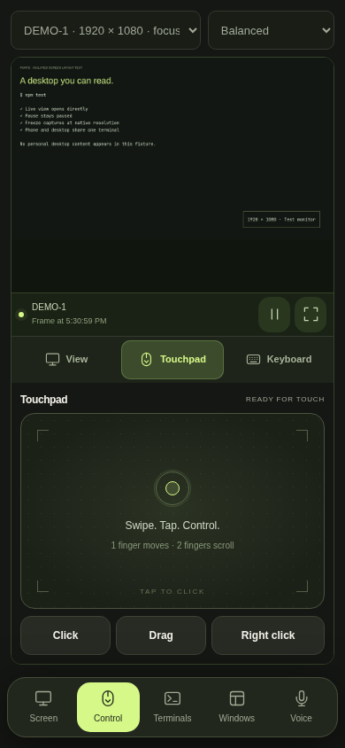
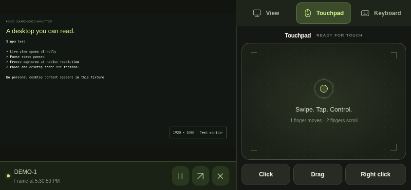
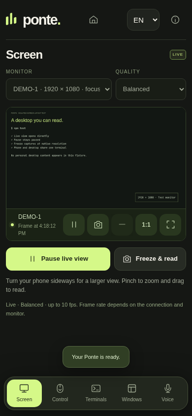
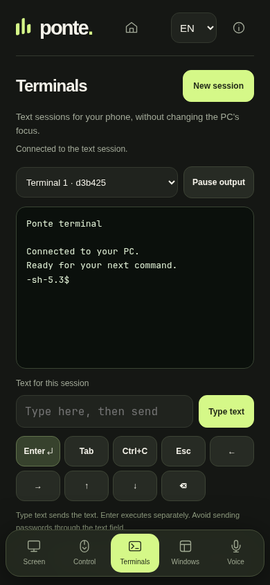
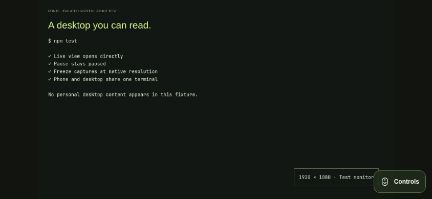

# Screen and terminals

This revision makes the monitor the first page after pairing or reopening Ponte. Screen and Terminals each have a permanent bottom navigation button. Control opens the touchpad or keyboard beside the same monitor. The home icon opens the PC dashboard.

## Read a monitor

Choose a monitor once. Ponte remembers it along with your quality preference. Live view starts while the Screen page is visible and stops when you leave or background the app. A manual pause survives connection polling and backgrounding. Opening Screen again from another page starts live view.

Rotate your phone and tap fullscreen to give the monitor more room. Hide controls to use the full height; the floating Controls button brings them back. Pinch to zoom, then drag to read another area. After you zoom, Ponte tells the PC the visible monitor rectangle (x, y, w, h) and captures only that region at scale 1 with `grim -g`. The live JPEG is that crop, not a stretched full-frame image. Zooming back out returns to the whole monitor at the selected quality. The minus button reduces zoom and the 1:1 button toggles between the whole monitor and a readable crop.

**Freeze & read** still requests one JPEG at the monitor's original resolution, then opens it at 1:1. This helps when you want a still frame you can pan without changing the live crop. The timestamp identifies it as a still image. Use play to return to live view. Freeze is also available through the camera button in fullscreen.

Live profiles remain capped at 10 fps. Full-frame live view still uses scale 0.50 or 0.65. A zoomed region is captured at scale 1 without raising the frame-size cap (8 MiB) or the fps ceiling. A snapshot does not increase those limits. Full-resolution screenshots are bounded to 12 MiB and an eight-second capture timeout.

## Control while watching

Use **View**, **Direct touch**, **Touchpad** and **Keyboard** directly beneath the monitor. View gives the image more room. Direct touch treats the image as the pointing surface: a tap is a left click at the matching monitor pixel (including the current zoom and pan), a long press is a right click, one-finger drag pans the image, and two fingers pinch. Touchpad keeps a live preview above the original pad in portrait, or beside it on a sideways phone. Keyboard keeps the image visible above or beside the text field, including when the Android keyboard reduces the available height. These modes are also available inside fullscreen.

The same stream continues across mode changes. A manual pause stays paused, with the still-image timestamp visible. The monitor capture includes the PC cursor. Monitor and quality choices persist. Pan and pinch on the image change which region you see; they do not move the PC pointer unless Direct touch is active. The separate touchpad still moves the pointer: one finger moves or taps, two fingers scroll or right-click, and Drag holds the left mouse button until Release. Hiding the input controls clears pending movement and releases a drag, including a press whose response arrives late.

Keyboard text goes to the PC's focused window shown above the field. **Send text** sends the draft; Enter remains a separate action. The shortcuts scroll horizontally on narrow screens. Changing mode preserves unsent text.

These are browser captures with a synthetic monitor. Browser checks cover pointer movement, taps, two-finger scrolling, uninterrupted streaming, keyboard viewport changes, explicit text sending, fullscreen input, draft preservation and releasing a delayed drag. Backend tests cover valid live regions, clamping, full-frame fallback and absolute clicks through a synthetic desktop adapter. Frontend tests cover touch-to-pixel mapping with zoom and pan, Direct touch versus Touchpad, and live region updates. The latest combined layout still needs its physical Redmi keyboard check.

## Work in a terminal

Install `tmux` on the PC, open Terminals and choose **New session**. Merely opening this page does not start a shell. Ponte manages up to four sessions using its own private tmux socket.

1. Type into the phone's text field and choose **Type text** to send it to the selected session.
2. Review it in the terminal output. Use the arrow keys and Backspace to edit the shell line.
3. Press **Enter** to execute. Ctrl+C interrupts the selected session's foreground command.

The terminal starts at 40 columns for phone readability. Choose 80 or 120 columns for wider output and scroll sideways when needed. Pause output while selecting or reading text. Unsent phone drafts remain when you switch sessions or pages during this app visit; they are not saved across a WebView reload.

To use the same shell on the PC, expand **Open this same session on the PC** and run the displayed attachment command in a local terminal. Both devices then share the same session. Ponte does not run that attachment command or change your desktop focus for you.

The output view is plain text, updated while Terminals is visible. It includes recent history with a 64 KiB response limit. It is not a full browser terminal emulator: colors, terminal mouse input, interactive cursor rendering and arbitrary terminal escape sequences are not implemented. Commands and text interfaces can receive the listed keys, but full-screen editors are not this view's primary use.

Closing the phone app leaves sessions available. Stopping or restarting the Ponte service, logging out of Linux, or restarting the PC may end them. **Close session** asks for confirmation and terminates that session and its processes. If a PC client enters tmux copy mode, exit that mode on the PC before sending more input from the phone.

## Existing terminal windows

The bottom of Terminals lists terminal windows already open on the PC. **Focus and view on monitor** explicitly focuses that window and opens its monitor in Screen. It does not import its shell into Ponte's text sessions.

The general Control keyboard still types into the PC's currently focused window, identified above the text field. Dedicated terminal input uses an exact session and pane, independent of desktop focus.

## Verification for this revision

The preview below uses a synthetic monitor with no personal desktop content. It is an actual capture of Ponte in its own Chromium test session. The terminal preview connects to a real tmux shell on a separate temporary socket.

 

Browser checks cover initial live entry, manual pause during polling, return to Screen, saved monitor/quality/pairing, native-size snapshot and pan, landscape fullscreen, real terminal input without implicit execution, resizing, language changes without losing drafts, explicit window focus, and closing the selected test session.

The backend suite covers private storage and socket ownership, exact targets, input validation, copy-mode races, interrupted creation cleanup, resource limits and HTTP authentication. Android proxy tests use real local synthetic HTTPS servers to check each terminal method/path, token forwarding, exact certificate pinning and request rejection. The personalized Android update compiles with the existing signing key.

The personalized alpha.2 update (Android version code5) was installed over the previous app on the physical Redmi with its existing signing key. Pairing survived, reopening went directly to live Screen, landscape fullscreen displayed the real monitor, and terminal text was observed before pressing Enter and then executing. The Android soft keyboard opened, but its complete layout and input flow were not verified before the phone returned to other use. Physical microphone recording is still pending.

Activity recreation exposed a loopback port-reuse failure during this test. A regression reproduced it before the fix; the updated proxy can immediately reopen its closed port while rejecting a second live listener. All 101 native proxy checks pass. Personal monitor captures remain private; the public previews above are synthetic.
